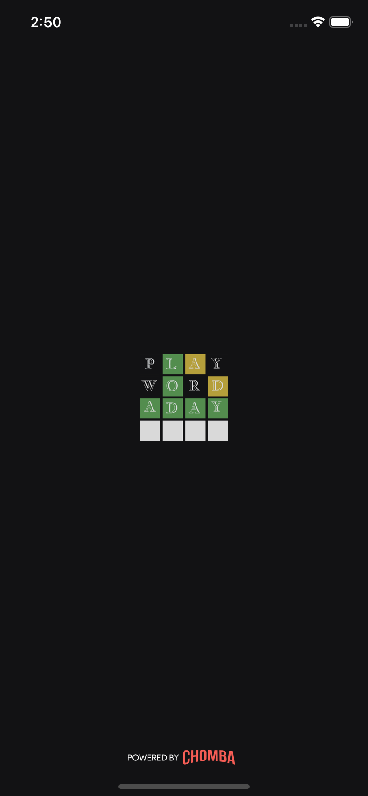
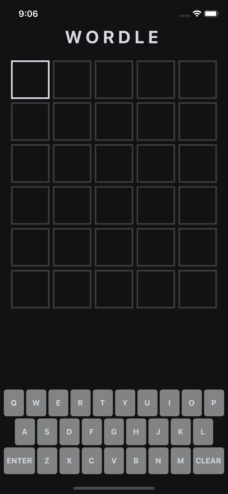
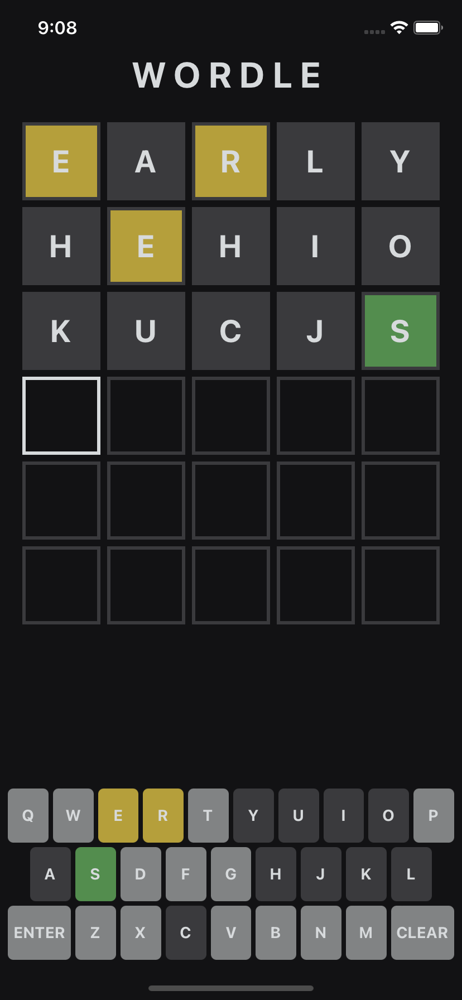
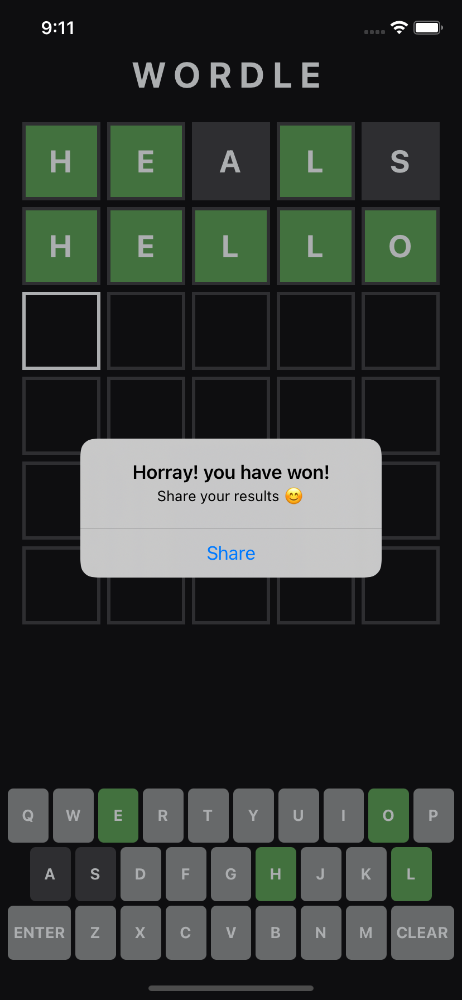

# Wordle by Chomba - React Native 

Guess the Wordle in 6 tries. Each guess must be a valid 5-letter word. The color of the tiles will change to show how close your guess was to the word.

## Features ✨

The game has few main features:

1. Guess random 5 letter word
2. Share results in a cool way 😎
3. Play again when you loose

## Screenshots 
Splash                      |  Landing         |  Game | Won
:-------------------------:|:------------------------:|:------------------------:|:------------------------:
  |   |   | 

## Future works

Provided more time, there are a few things I can need improving.

1. Add animations
2. Add sound effects
3. Add tests 🧪
4. Add Authentication with user login and registrations 🔐
5. Track player statistics
6. Improve UI 👌🏽

## Stay creative 🚀
